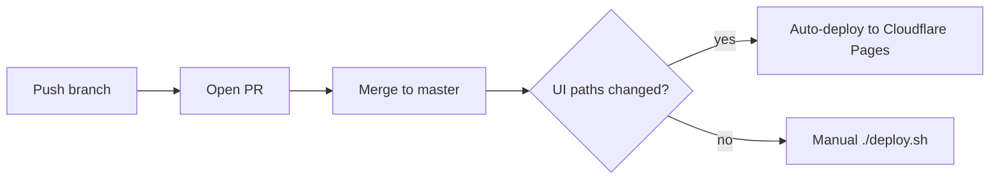
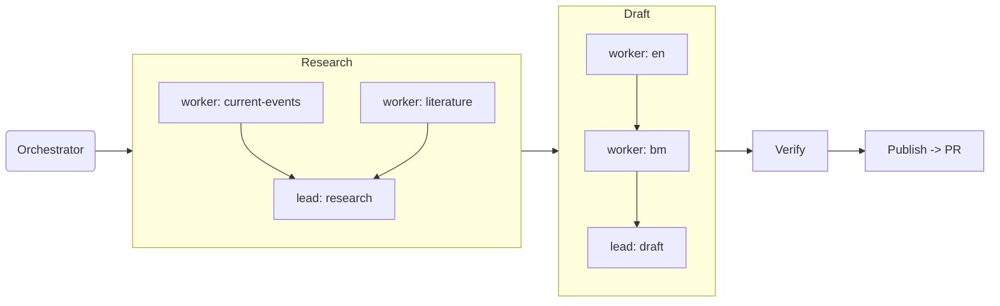

# Cyber Pujangga

Bilingual (English / Bahasa Melayu) essays, journal, and poems — a static Astro 5 site on Cloudflare Pages, built almost entirely through agent-driven development.

**Live:** [cyber-pujangga.pages.dev](https://cyber-pujangga.pages.dev)

## Stack
Astro 5 · Markdown content collections · plain CSS · Biome · Cloudflare Pages (Wrangler)

## Develop
```bash
cd cyber-pujangga-site && npm install && npm run dev   # localhost:4321
```

## Add content
```bash
./new-piece.sh essay my-new-essay
./new-piece.sh journal 2026-07-14-some-day
./new-piece.sh poem a-quiet-poem --lang ms
```
One file per language (`en/` / `ms/`) — no translation pairing.

## Deploy

UI changes (`src/components`, `src/layouts`, `src/styles`, `public`, `astro.config.ts`, `src/site.config.ts`) deploy automatically on merge to `master`. Content-only changes still need a manual `./deploy.sh`.

## Agentic setup
Built for coding agents to work in directly:
- `AGENTS.md` / `CLAUDE.md` — conventions & commands
- `CONTEXT.md` — why it's built this way
- `PLAN.md` — what's active
- `STYLE.md` — writing voice
- `.claude/skills/` — `new-piece`, `deploy-site`, `bilingual-check`
- `.claude/workflows/weekly-content-crew.js` — orchestrator + lead/worker agent crew (opens a PR, never auto-merges):



## License
Personal project — content and code not licensed for reuse unless stated otherwise.
